# <p align="right" >قالب فارسی زبان کتاب</p>

<p align="right">
&#x202b;
این قالب تحت
`Xelatex 2020`
آماده شده است اما
`Xelatex 2019`
نیز به خوبی با آن هماهنگ است.
دستورات آماده شده در این قالب به همراه نحوه استفاده، نمونه‌ی استفاده و خروجی متناظر
در زیر فهرست شده‌اند:
</p>

---
---
<!-- -------------------------------------------------------------------------------------------------- -->


<code style="margin-right:3%;">
\COVER[image path]
</code>

<br/>

<p align="right" style="margin-right:21%;">
&#x202b;
با استفاده از این دستور، می‌توانید یک صفحه پوشانده شده با تصویر
(با هدف تصویر جلد کتاب)
ایجاد کنید. لازم است آدرس مربوط به تصویر موردنظر را به آن ورودی دهید.
</p>

```latex
\COVER[./cover.jpg]
```
<br/><br/><br/><br/><br/>

---
<!-- -------------------------------------------------------------------------------------------------- -->

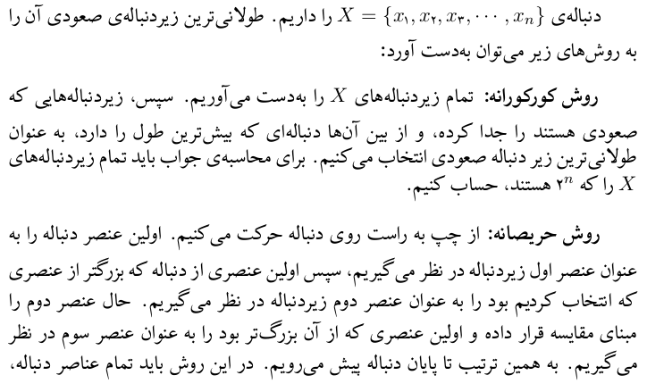

<code style="margin-left:3%;">
\p
</code>

<br/>

<p align="right" style="margin-left:21%;">
&#x202b;
این دستور یک پاراگراف جدید ایجاد می‌کند.
عوامل متأثر، تورفتگی ابتدای پاراگراف و فاصله‌ی زیادتر از خط قبلی است.
</p>

```latex
\p
دنباله‌ی
$X = \{x_1, x_2, x_3, \cdots, x_n\}$
را داریم. طولانی‌ترین زیردنباله‌ی صعودی
آن را به روش‌های زیر می‌توان به‌دست آورد:

\p
\textbf{روش کورکورانه:} 
تمام زیردنباله‌های
...

\p
...
```

---
<!-- -------------------------------------------------------------------------------------------------- -->

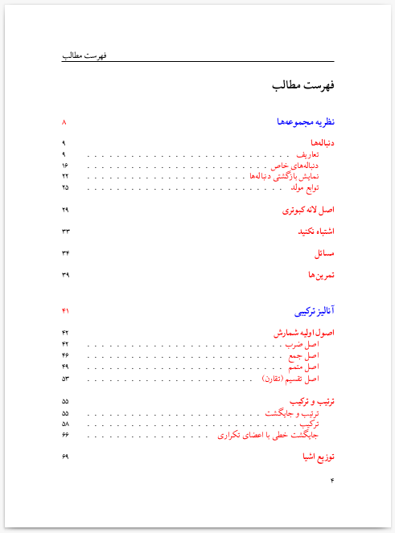

<code style="margin-right:3%;">
\TOC
</code>

<br/>

<p align="right" style="margin-right:21%;">
&#x202b;
این دستور، به صورت خودکار، بر اساس مطالب آورده شده در کتاب،
صفحات فهرست را ایجاد می‌کند. برای اجرا شدن درست این دستور،
نیاز به دو بار کامپایل کردن محتوا است.
</p>

```latex
\TOC
```
<br/><br/><br/><br/><br/>

---
<!-- -------------------------------------------------------------------------------------------------- -->


<code style="margin-left:3%;">
\CHAPTER[image path]{chapter name}{introduction paragraph}
</code>

<br/>

<p align="right" style="margin-left:21%;">
&#x202b;
این دستور، صفحه‌ی آغاز فصل را ایجاد می‌کند.
نحوه عملکرد این دستور را می‌بینید. شمارنده فصل‌ها به صورت خودکار افزایش می‌یابد.
نامی که در این دستور برای فصل انتخاب می‌کنید، در سربرگ صفحات این فصل
(تا قبل از رسیدن به صفحه اول فصل بعدی)،
ظاهر خواهد شد.
همچنین، این دستور باعث ثبت نام فصل در فهرست می‌شود.
ورودی سوم این دستور، توضیحات فصل می‌باشد که شامل یک بند مقدمه است.
</p>

```latex
\CHAPTER[./SetTheory.jpg]{نظریه مجموعه‌ها}{
    نظریه مجموعه‌ها شاخه‌ای از علم ریاضی است که به مطالعه مجموعه‌ها می‌پردازد.
    مجموعه‌ها به صورت کلی، به گردایه‌ای از اشیاء گفته می‌شود.
    این اشیاء می‌توانند هرچیزی باشند.
    مباحث مربوط به نظریه مجموعه‌ها بسیار گسترده می‌باشد.
    این فصل از کتاب هنوز کامل نشده و تنها قسمت‌هایی
    از آن که برای مباحث آینده نیاز است، نوشته شده است.
}
```

---
<!-- -------------------------------------------------------------------------------------------------- -->

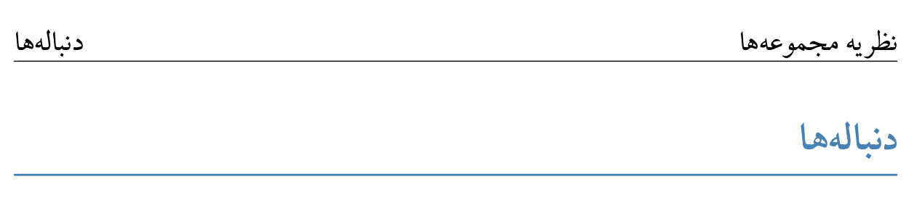

<code style="margin-right:3%;">
\SECTION{section name}
</code>

<br/>

<p align="right" style="margin-right:21%;">
&#x202b;
این دستور، یک بخش جدید ایجاد می‌کند. نام بخش که در این دستور آورده می‌شود،
در فهرست مطالب و سربرگ صفحات آن بخش (قبل از رسیدن به آغاز بخش بعدی)
ثبت خواهد شد.
</p>

```latex
\SECTION{دنباله‌ها}
```

---
<!-- -------------------------------------------------------------------------------------------------- -->


<code style="margin-left:3%;">
\SUBSECTION{subsection name}
</code>

<br/>

<p align="right" style="margin-left:21%;">
&#x202b;
این دستور، یک زیربخش جدید ایجاد و نام این زیربخش را در فهرست مطالب می‌کند.
</p>

```latex
\SUBSECTION{تعاریف}
```

---
<!-- -------------------------------------------------------------------------------------------------- -->


<code style="margin-right:3%;">
\FOCUSEDON{word}
</code>

<br/>

<p align="right" style="margin-right:21%;">
&#x202b;
این دستور، یک لغت را به صورت خاصی از بقیه‌ی متن متمایز می‌کند.
</p>

```latex
\p
به زبان ساده‌تر، به اعدادی که به تعداد متناهی یا نامتناهی دارای ترتیب باشند،
\FOCUSEDON{دنباله}
گوییم. در دنباله‌ها تکرار مجاز است و ترتیب اهمیت دارد.
باید توجه داشت که در برخی منابع، دامنه‌ی دنباله‌ها تنها اعداد طبیعی در نظر گرفته شده است.
```

---
<!-- -------------------------------------------------------------------------------------------------- -->

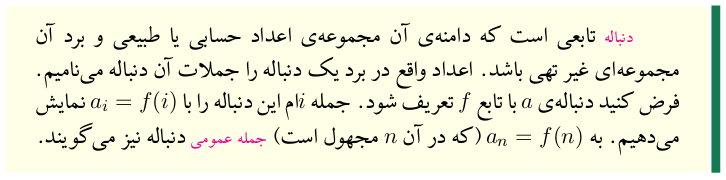

<code style="margin-left:3%;">
\begin{DEFINISION} ... \end{DEFINISION}
</code>

<br/>

<p align="right" style="margin-left:21%;">
&#x202b;
این دستور یک جعبه تعریف می‌سازد.
</p>

```latex
\begin{DEFINITION}
    \FOCUSEDON{دنباله}
    تابعی است که دامنه‌ی آن مجموعه‌ی اعداد حسابی یا طبیعی و برد آن مجموعه‌ای غیر تهی باشد.
    اعداد واقع در برد یک دنباله را جملات آن دنباله می‌نامیم. فرض کنید دنباله‌ی
    $a$ با تابع $f$ تعریف شود. جمله $i$ام این دنباله را با $a_i = f(i)$ نمایش می‌دهیم.
    به $a_n = f(n)$ (که در آن $n$ مجهول است)
    \FOCUSEDON{جمله}
    \FOCUSEDON{عمومی}
    دنباله نیز می‌گویند.
\end{DEFINITION}
```

---
<!-- -------------------------------------------------------------------------------------------------- -->

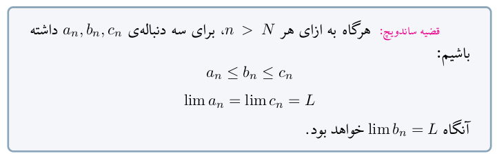

<code style="margin-right:3%;">
\begin{THEOREM} ... \end{THEOREM}
</code>

<br/>

<p align="right" style="margin-right:21%;">
&#x202b;
این دستور یک جعبه قضیه می‌سازد.
</p>

```latex
\begin{THEOREM}
    \p
    \FOCUSEDON{قضیه ساندویچ:}
    هرگاه به ازای هر $n > N$، برای سه دنباله‌ی $a_n , b_n , c_n$ داشته باشیم:
    $$a_n \leq b_n \leq c_n$$
    $$\lim a_n = \lim c_n = L$$
    آنگاه
    $\lim b_n = L$
    خواهد بود.
\end{THEOREM}
```

---
<!-- -------------------------------------------------------------------------------------------------- -->

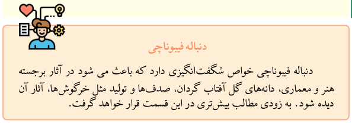

<code style="margin-left:3%;">
\begin{EXTRA}[extra logo path]{extra name} ... \end{EXTRA}
</code>

<br/>

<p align="right" style="margin-left:21%;">
&#x202b;
این دستور، یک جعبه بیشتر بدانید می‌سازد.
برای این جعبه‌ها، یک لوگوی پیشفرض قرار داده شده است که می‌توانید
با وارد کردن آدرس لوگو جایگزین خود به عنوان ورودی (اختیاری) اول دستور،
آن را تغییر دهید.
</p>


```latex
\begin{EXTRA}{دنباله فیبوناچی}
    \p
    دنباله فیبوناچی خواص شگفت‌انگیزی دارد که باعث می شود در آثار برجسته هنر و معماری، دانه‌های گل آفتاب گردان،
    صدف‌ها و تولید مثل خرگوش‌ها، آثار آن دیده شود. به زودی مطالب بیش‌تری در این قسمت قرار خواهد گرفت.
\end{EXTRA}
```

---
<!-- -------------------------------------------------------------------------------------------------- -->

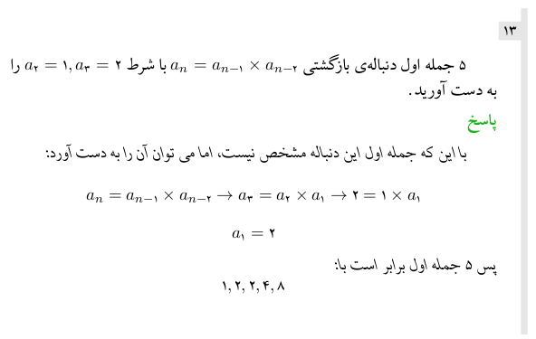

<code style="margin-right:3%;">
\begin{PROBLEM}[problem name] ... \end{THEOREM}
</code>
<br/>
<code style="margin-right:3%;">
\SOLUTION[solution name] {solution body}
</code>

<br/>

<p align="right" style="margin-right:21%;">
&#x202b;
از این دستورات برای ایجاد مسائل بین درسنامه استفاده می‌شود.
دستور اول یک جعبه سوال ایجاد می‌کند. این دستور شمارنده‌ی مسائل را زیاد می‌کند.
اگر در این دستور، نام سوال را وارد نکنید، چیزی بجای آن نوشته نمی‌شود و جای آن خالی می‌ماند.
دستور دوم، یک عنوان پاسخ، با متن داده شده به عنوان نام پاسخ، ایجاد می‌کند.
اگر نام پاسخ به دستور داده نشود، بجای آن عبارت «پاسخ» درنظر گرفته خواهد شد.
همچنین بدنه‌ی داده شده به این دستور، به فرمت پاسخ (با فونتی متفاوت) در خواهد آمد.
توجه کنید که می‌توان درون یک مسئله، بیش از یک پاسخ قرار داد.
</p>

```latex
\begin{PROBLEM}
    \p
    ۵ جمله اول دنباله‌ی بازگشتی $a_n=a_{n-1}\times a_{n-2}$ با شرط $a_2=1, a_3=2$ را به دست آورید.

    \SOLUTION{
        \p
        ...
    }
\end{PROBLEM}
```

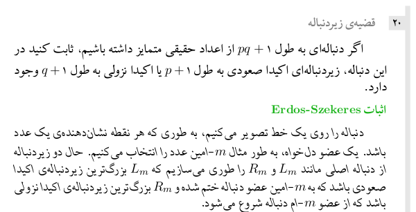

```latex
\begin{PROBLEM}[قضیه‌ی زیردنباله]
    \p
    اگر دنباله‌ای به طول 
    $pq + 1$
    از اعداد حقیقی متمایز داشته باشیم، ثابت کنید در این دنباله، زیر‌دنباله‌ای اکیدا صعودی به طول 
    $p+1$
    یا اکیدا نزولی به طول 
    $q+1$
    وجود دارد. 

    \SOLUTION[اثبات \lr{Erdos-Szekeres}]{
        \p
        ...
    }
\end{PROBLEM}
```

---
<!-- -------------------------------------------------------------------------------------------------- -->

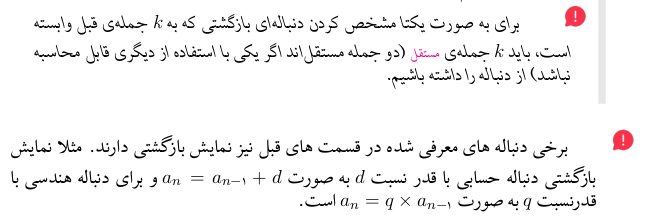

<code style="margin-left:3%;">
\NOTE[right-margin]{text}
</code>

<br/>

<p align="right" style="margin-left:21%;">
&#x202b;
با این دستور می‌توانید یک نکته ایجاد کنید. یک نکته دارای یک علامت خاص، سمت راست خود
(خارج از کادر متن)
است که جلب توجه می‌کند. توجه کنید که دستور نکته، خود یک پاراگراف جدید ایجاد می‌کند.
درصورت نیاز به پاراگراف‌های بیشتر، می‌توانید داخل آن از دستور ایجاد پاراگراف استفاده کنید.
</p>

<p align="right" style="margin-left:21%;">
&#x202b;
اگر از این دستور، درون دستورات دیگر استفاده کنید، ممکن است میزان عقب‌نشینی آن به سمت راست مطلوب شما نباشد.
می‌توانید با مقدار‌دهی ورودی اول آن (که مقدار پیشفرض دارد و در مثال بالا از آن استفاده نکردیم)، میزان این عقب‌نشینی
را تعیین کنید.
</p>

```latex
\begin{some box}
    \NOTE[-1cm]{
        برای به صورت یکتا مشخص کردن دنباله‌ای بازگشتی که به $k$ جمله‌ی قبل وابسته است، باید $k$ جمله‌ی
        \FOCUSEDON{مستقل} (دو جمله مستقل‌اند اگر یکی با استفاده از دیگری قابل محاسبه نباشد) از دنباله را داشته باشیم.
    }
\end{some box}

\NOTE{
    برخی دنباله های معرفی شده در قسمت های قبل نیز نمایش بازگشتی دارند. مثلا نمایش بازگشتی دنباله حسابی با قدر نسبت 
    $d$ به صورت $a_n=a_{n-1}+d$ و برای دنباله هندسی با قدرنسبت $q$ به صورت $a_n=q \times a_{n-1}$ است.
}
```

---
<!-- -------------------------------------------------------------------------------------------------- -->

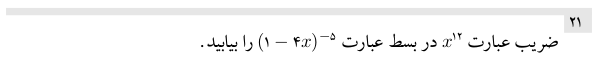

<code style="margin-right:3%;">
\EPROBLEM
</code>

<br/>

<p align="right" style="margin-right:21%;">
&#x202b;
این دستور، یک مسئله پایان‌فصل جدید ایجاد می‌کند. تاثیر آن، رسم یک خط افقی
و زیاد کردن شمارنده مسائل است.
</p>

```latex
\EPROBLEM
\p
ضریب عبارت $ x ^ {12}$ در بسط عبارت $(1-4x)^{-5}$ را بیابید.
```

---
<!-- -------------------------------------------------------------------------------------------------- -->

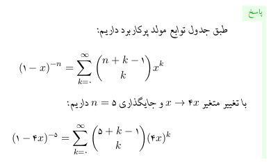

<code style="margin-left:3%;">
\ESOLUTION[solution name]{solution body ...}
</code>

<br/>

<p align="right" style="margin-left:21%;">
&#x202b;
با اجرای این دستور، یک جعبه پاسخ برای مسائل آخر فصل ساخته می‌شود.
این جعبه، درواقع یک نوار سبز‌رنگ سمت راست صفحه است.
در ابتدای این نوار، نام سوال که ورودی اختیاری دستور است نوشته می‌شود.
این نام به صورت پیشفرض، عبارت «پاسخ» است.
</p>

```latex
\ESOLUTION{
    \p
    طبق جدول توابع مولد پرکاربرد داریم:
    $$(1 - x) ^ {-n} = \sum_{k = 0}^{\infty} \binom{n + k - 1}{k} x^{k} $$
    با تغییر متغیر $x \rightarrow 4x$ و جایگذاری $n=5$ داریم:
    $$(1 - 4x) ^ {-5} = \sum_{k = 0}^{\infty} \binom{5 + k - 1}{k} (4x)^k $$
}
```

---
<!-- -------------------------------------------------------------------------------------------------- -->

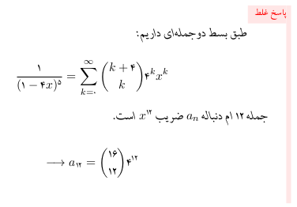

<code style="margin-right:3%;">
\EWSOLUTION[solution name]{solution body ...}
</code>

<br/>

<p align="right" style="margin-right:21%;">
&#x202b;
این دستور کاملا مشابه دستور قبل (ESOLUTION) است
با این تفاوت که برای پاسخ‌های غلط آماده شده است؛
نوار سمت راست آن قرمزرنگ بوده و نام پیشفرض آن «پاسخ غلط» است.
</p>

```latex
\EWSOLUTION{
    \p
    طبق بسط دوجمله‌ای داریم:    
    $$\frac{1}{(1-4x)^5}=\sum\limits_{k=0}^{\infty} \binom{k+4}{k}  4 ^ k  x^ k$$
    جمله ۱۲ ام دنباله $ a_n$ ضریب $ x ^ {12} $ است.
    $$\longrightarrow a_{12} = \binom{16}{12} 4 ^ {12}$$
}
```

---
<!-- -------------------------------------------------------------------------------------------------- -->

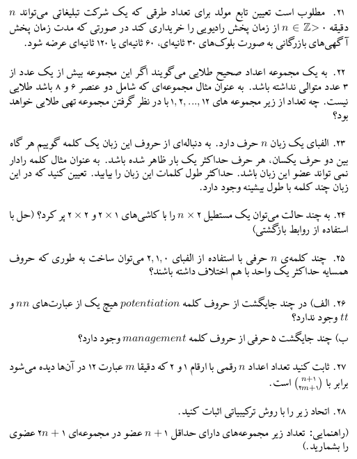

<code style="margin-left:3%;">
\EXERCISE
</code>

<br/>

<p align="right" style="margin-left:21%;">
&#x202b;
این دستور تنها یک شماره برای تمرین‌ها ایجاد کرده و آن را افزایش می‌دهد.
</p>

```latex
\EXERCISE
بدنه‌ی سوال اول

\EXERCISE
بدنه‌ی سوال دوم

\EXERCISE
بدنه‌ی سوال سوم

...
```

---
<!-- -------------------------------------------------------------------------------------------------- -->

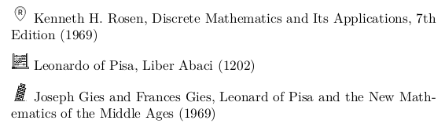

<code style="margin-right:3%;">
\SOURCE{logo-name}
</code>
<br/>
<code style="margin-right:3%;">
\SOURCELINE{logo-name}{definition}
</code>
<br/>
<code style="margin-right:3%;">
\LRTSOURCELINE{logo-name}{definition}
</code>

<br/>

<p align="right" style="margin-left:21%;">
&#x202b;
با این دستورات، یک منبع جدید تعریف می‌شود. دستور اول برای تعریف منبع کافیست.
دستور دوم برای ساخت فهرست منابع استفاده می‌شود. دستور سوم هم‌ارز دستور دوم برای منابع با زبان‌های 
چپ به راست است.
لازم است یک لوگو متناظر در
آدرس
\lr{Contents/Refrences/Icons/logo-name.png}
قرار گیرد.
</p>

```latex
\LRTSOURCELINE{R}{
    Kenneth H. Rosen, Discrete Mathematics and Its Applications, 7th Edition (1969)
}
\LRTSOURCELINE{Liber_Abaci}{
    Leonardo of Pisa, Liber Abaci (1202)
}
\LRTSOURCELINE{Leonard_of_Pisa_and_the_New_Mathematics_of_the_Middle_Ages}{
    Joseph Gies and Frances Gies, Leonard of Pisa and the New Mathematics of the Middle Ages (1969)
}
```

---
<!-- -------------------------------------------------------------------------------------------------- -->


<code style="margin-left:3%;">
\REF{source-name}
</code>

<br/>

<p align="right" style="margin-left:21%;">
&#x202b;
با این دستور می‌توان به یک منبع (source) از پیش تعیین شده ارجاع داد.
source-name
همان logo-name
در source
مقصود است.
</p>

```latex
\begin{EXTRA}[./Leonardo.jpeg]{\REF{Leonard_of_Pisa_and_the_New_Mathematics_of_the_Middle_Ages} فیبوناچی }
```

---
<!-- -------------------------------------------------------------------------------------------------- -->

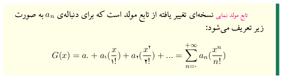

<code style="margin-right:3%;">
\TARGET[what we see]{key}
</code>

<br/>

<p align="right" style="margin-left:21%;">
&#x202b;
با استفاده از این دستور، یک مقصد برای ارجاع داخلی تعریف می‌شود. از 
key
برای آدرس دادن به نقطه ارجاع دهنده استفاده می‌شود. عمدتاً نیازی به پر کردن بخش نمایشی نیست.
</p>

```latex
\begin{DEFINITION}
    \p
    \FOCUSEDON{تابع مولد نمایی}\TARGET{تابع مولد نمایی}
    نسخه‌ای تغییر یافته از تابع مولد است که
    برای دنباله‌ی 
    $a_{n}$
    به صورت زیر تعریف می‌شود:
      $$G(x)= a_{0} + a_{1}(\frac{x}{1!}) + a_{2}(\frac{x^{2}}{2!}) + ... = \sum\limits_{n=0}^{+\infty} a_{n}(\frac{x^{n}}{n!})$$
\end{DEFINITION}
```

---
<!-- -------------------------------------------------------------------------------------------------- -->

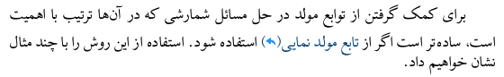

<code style="margin-left:3%;">
\CROSSREF[what we see]{key}
</code>

<br/>

<p align="right" style="margin-left:21%;">
&#x202b;
با استفاده از این دستور، به یک Target ارجاع داخلی می‌دهیم.
اگر قسمت نمایشی مقدار دهی نشود، از key بجای آن استفاده می‌شود.
</p>

```latex
برای کمک گرفتن از توابع مولد در حل مسائل شمارشی که در آن‌ها ترتیب با اهمیت است،
ساده‌تر است اگر از \CROSSREF{تابع مولد نمایی} استفاده شود.
استفاده از این روش را با چند مثال نشان خواهیم داد.
```

---
<!-- -------------------------------------------------------------------------------------------------- -->

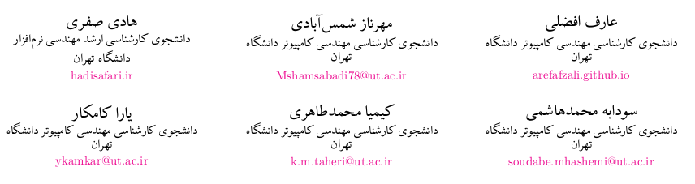

<code style="margin-right:3%;">
\begin{AFFILIATIONS} ... \end{AFFILIATIONS}
</code>
<br/>
<code style="margin-right:3%;">
\AFFILIATIONROW
</code>
<br/>
<code style="margin-right:3%;">
\AFFILIATIONURL{what we see}{actual url}
</code>

<br/>
<br/>

<p align="right" style="margin-right:21%;">
&#x202b;
با استفاده از دستورات بالا،
همکاران را به شیوه مرسوم فهرست می‌کنیم.
</p>

<br/>

```latex
\begin{AFFILIATIONS}
    \AFFILIATIONROW
    {عارف افضلی}{دانشجوی کارشناسی مهندسی کامپیوتر دانشگاه تهران}{\AFFILIATIONURL{arefafzali.github.io}{https://arefafzali.github.io}}
    {مهرناز شمس‌آبادی}{دانشجوی کارشناسی مهندسی کامپیوتر دانشگاه تهران}{\AFFILIATIONURL{Mshamsabadi78@ut.ac.ir}{mailto:Mshamsabadi78@ut.ac.ir}}
    {هادی صفری}{دانشجوی کارشناسی ارشد مهندسی نرم‌افزار دانشگاه تهران}{\AFFILIATIONURL{hadisafari.ir}{https://hadisafari.ir}}
    \\\AFFILIATIONROW
    {سودابه محمدهاشمی}{دانشجوی کارشناسی مهندسی کامپیوتر دانشگاه تهران}{\AFFILIATIONURL{soudabe.mhashemi@ut.ac.ir}{mailto:soudabe.mhashemi@ut.ac.ir}}
    {کیمیا محمدطاهری}{دانشجوی کارشناسی مهندسی کامپیوتر دانشگاه تهران}{\AFFILIATIONURL{k.m.taheri@ut.ac.ir}{mailto:k.m.taheri@ut.ac.ir}}
    {یارا کامکار}{دانشجوی کارشناسی مهندسی کامپیوتر دانشگاه تهران}{\AFFILIATIONURL{ykamkar@ut.ac.ir}{mailto:ykamkar@ut.ac.ir}}
\end{AFFILIATIONS}
```

---
<!-- -------------------------------------------------------------------------------------------------- -->